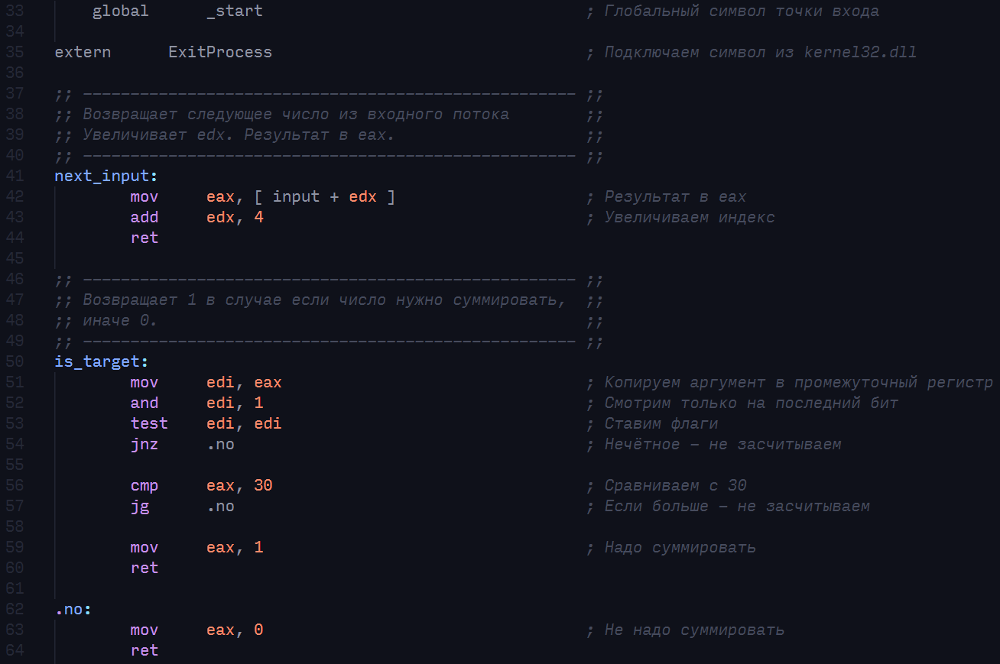

## Решение задач из ОГЭ на Ассемблере
### Введение

В этом репозитории я собрал пару прокомментированных решений заданий _15.2 ОГЭ по информатике_ на _ассемблере_.

### Быстрый старт ( Windows )

Зависимости :
    - [TCC](https://bellard.org/tcc/)
    - [NASM](https://nasm.us/)
    - [MAKE](https://sourceforge.net/projects/mingw-w64/)    

- #### Шаг 1 - клонирование репозитория
С помощью **git** :

    git clone https://github.com/Nikita-bunikido/Exam_Assembler.git

- #### Шаг 2 - сборка программы
Перейдите в директорию с примерами, и соберите с помощью **gnu make**:

    cd Exam_Assembler
    make

### Отладчик
**Программы не взаимодействуют с терминалом**. Для того, чтобы отследить пошаговое выполнение программы вам потребуется динамический отладчик. 

Например:
    - [GDB](https://sourceforge.net/projects/mingw-w64/)
    - [X32DBG](https://x64dbg.com/)

Я использую _x32dbg_, потому что у него есть много удобных инструментов для перемещения по программе, памяти, и стеку, а ещё он имеет графический интерфейс.

### Разработка
Вы также можете писать свои решения, и создавать ветки. Я буду принимать пулл-реквесты.